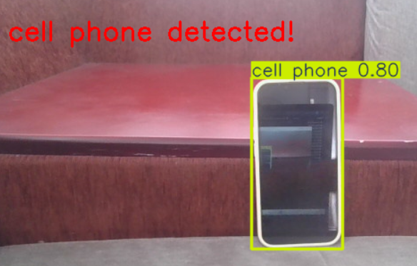

# Mobile Phone Detector using YOLOv8

## Description

A real-time mobile phone detection system developed using Python, OpenCV, and YOLOv8. The application continuously monitors a webcam feed and detects mobile phones in real time. When a phone is detected, the system displays an alert message on the screen.

## Features

- Real-time webcam monitoring
- Mobile phone detection using YOLOv8
- Live detection alerts
- Bounding box visualization
- Real-time computer vision processing
- Lightweight implementation

## Technologies Used

- Python
- OpenCV
- YOLOv8 (Ultralytics)

## Screenshots

### Mobile Phone Detection



## How to Run

1. Install dependencies

```bash
pip install ultralytics opencv-python
```

2. Run the program

```bash
python mobile_phone_detector.py
```

## Project Structure

```text
mobile-phone-detector
│
├── mobile_phone_detector.py
├── phone_detected.png
└── README.md
```

## Author

Fasna Shabeer
